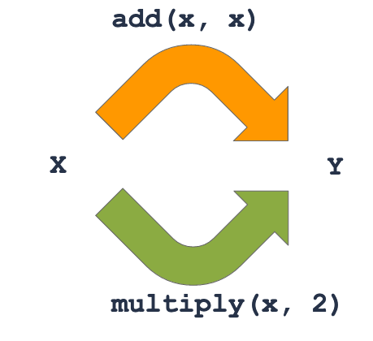
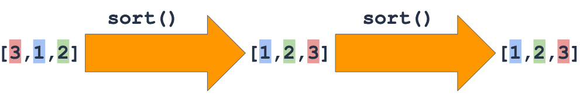
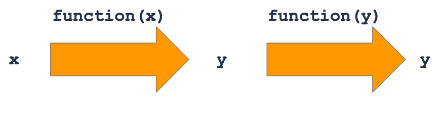

# Troll of Fame - ReasonML

Ce projet utilise [ReasonML](https://reasonml.github.io) avec le workflow [esy](https://esy.sh/) et le build system [Dune](https://github.com/ocaml/dune).

## Les modules

ReasonML intègre un système de programmation modulaire. Les modules offrent un mécanisme d'encapsulation et permettent d'organiser le code en unités logiques, en fournissant des espaces de noms (namespaces) utiles lors de leur utilisation. ReasonML propose un système de modules récursifs et paramétrables très puissant qui permet de fournir une grande généricité au code.

En ReasonML, tout le code est encapsulé dans des modules. Si nous plaçons l'ensemble du code du premier TP dans un fichier Game.re, cela définit automatiquement un module Game.

_Le nom d'un module commence toujours par une majuscule, la convention veut que l'on nomme les fichiers ReasonML en commençant également par une majuscule mais ce n'est pas une obligation : le fichier game.re aurait également définit le module Game_

#### Open Modules

Imaginons que nous disposions du module et du sous-module

```reason
  module Fairy = {
    module Animal = {
      type t =
      | Unicorn
      | Dragon
      | Manticor
      | Mermaid;
    }

    let redDragon = Animal.Dragon;
  }
```

Vous remarquerez le nommmage des types `t` : il s'agit d'une convention largement utilisée dans les écosystèmes ReasonML / OCaml, où le type nommé `t` désigne le type principal habitant le module. On utilise `Animal.t` plutôt que `Animal.animal` bien que ce ne soit pas une obligation.

Pour accèder au contenu du module, il est possible de l'ouvrir. Plutôt que d'écrire :

```reason
  let defaultValue = Fairy.Animal.redDragon;
```

On peut écrire, pour y accèdes dans l'ensemble d'un fichier :

```reason
  open Fairy;
  let defaultValue = Animal.redDragon;
```

Ou

```reason
  open Fairy.Animal;
  let defaultValue = redDragon;
```

Le contenu du module est visible dans le scope. Ci dessus dans l'ensemble du fichier mais il est possible d'avoir un scope par expression :

```reason
  let defaultValue = Fairy.(Animal.redDragon);
```

ou de créer un scrope limité :

```reason
  {
    open Fairy;
    let defaultValue = Animal.redDragon;
  }
```

Si vous voulez en savoir plus sur le système de module riche de ReasonML, lisez [ResonML : les modules](https://oteku.github.io/reasonml-modules/)

## Getting started

- Install esy : `npm install -g esy`
- Install dependencies : `esy install`
- Build the app : `esy build`
- Run compiled executable : `esy x TOF.exe` _(a sample troll of fame)_
- Run tests : `esy test`

Nota Bene : Si vous utilisez VSCode, vous devriez installer le module [OCaml and Reason IDE](https://marketplace.visualstudio.com/items?itemName=freebroccolo.reasonml) et activer le paramètre de lentille _Reason › Codelens: Enabled_

```
troll-of-fame@0.0.0
│
├─test/lib/
│   name:    Runner
│   main:    Runner
│   require: troll-of-fame
│
├─lib/
│   library name: Lib
│   namespace:    troll-of-fame
│   require:
│
└─bin/
    name:    TOF.exe
    main:    TOF
    require: troll-of-fame
```

## Quels fichiers devez vous modifier ?

Tous les nouveaux tests de propriétés doivent être inclus, selon que vous testiez des elfes ou des trols, dans :

- [Elf_prop.re](./test/lib/Elf_prop.re)
- [Troll_prop.re](./test/lib/Troll_prop.re)

Les tests unitaires existant peuvent vous servir d'une sorte de spécification... du moins vous pouvez l'espérer :

- [Elf_test.re](./test/lib/Elf_test.re)
- [Troll_test.re](./test/lib/Troll_test.re)

Si vous découvriez des bugs, ils sont à corriger, selon le cas, dans :

- [lib/Elf.re](./lib/Elf.re)
- [lib/Troll.re](./lib/Troll.re)

## Once upon a time ⋯

Le roi des Trolls, Gnonpom, a codé le **Troll of Fame** : une application fabuleuse qui aide les Trolls à apprendre les nombres quand ils chassent. Gnonpom était un roi développeur, féru de test driven développement. il a mis en production **TOF** quand tous les tests étaient verts.

Malheureusement, il a été abattu par un horrible elfe.

Vive le nouveau roi, vive le troll aklass!

Cette fois c’est décidé le tournoi de chasse à l’elfe est lancé !

À la fin de chaque bataille, les trolls veulent comparer les nombres et attributs de ces elfes dégoutants.
avec **TOF** ça devrait être facile ⋯ ça devrait.

## Excercices

### Work with legacy code

Vous héritez d'une application qui semble fonctionner. Exécutez `esy test` (•̀ᴗ•́)و ̑̑

Lisez [Elf_test.re](./test/lib/Elf_test.re) et [Troll_test.re](./test/lib/Troll_test.re) en tant que première spécification du logiciel.

Maintenant décommentez [Elf_prop.re](./test/lib/Elf_prop.re) et lancez à nouveau les tests `esy test` ⋯ Ooops il semble que les tests unitaires ne soient pas si exhuastifs. (╥﹏╥)

Nous allons améliorer la qualité de l'application _Troll of Frame_ grâce aux tests de propriétés (Property Based Testing)

### Property testing

Le _Property Based Testing_ (a.k.a PBT) consiste à générer des tests au lieu de les écrire manuellement. Contrairement aux tests unitaires où vous savez ce qui entre et ce qui sort, vous évaluez des propriétés qui devraient toujours être vraies. La bibliothèque PBT vérifie pour des entrées arbitraires que la propriété est vraie.

En ReasonML, nous utiliserons la librairie `qcheck-rely` pour écrire et executer des PBT avec `rely` que nous avons utilisé dans le TP précédent.

#### Step 1 - Configuration and Invariance


_Quelle que soit l'année, le 31 Décembre est le réveillon du nouvel an_

- Pour un démarrage plus simple, nous avons déjà configuré les dépendances et créé des générateurs d'`Elf` et de `Troll` dans la bibliothèque de test. Vous pouvez consulter `Generator.re` si vous êtes curieux, mais les générateurs ne font pas parti de ce TP.

- les tests PBT sont dans [Elf_prop.re](./test/lib/Elf_prop.re) et [Troll_prop.re](./test/lib/Troll_prop.re)

- Le premier test de propriété que nous allons écrire vise à évaluer la propriété d'**invariance** : cela signifie qu'une propriété doit toujours être vraie même si l'entrée varie (par exemple l'`Elf`)

- Par exemple, peu importe l'`Elf`, sa valeur est toujours > 0...

```OCaml
open Framework;
open QCheckRely;
open Generator.Fantasy;
open Lib.Elf;

let {describe} = extendDescribe(QCheckRely.Matchers.matchers);

/* Porperties Based Tests */
describe("Elf Invariance", ({test}) => {
  test("Elf value should always be positive", ({expect})
    => {
      QCheck.Test.make(
        ~count=1000,
        ~name="elf value should always be positive",
        elf_arbitrary,
        elf =>
        value(elf) > 0
      )
      |> expect.ext.qCheckTest;
      ();
    })
});
```

- Avez-vous remarqué que le test de propriété prend un `Elf.t` en entrée? C'est là que PBT brille! La bibliothèque exécutera ce test 1000 fois, et chaque fois lui passera un `Elf` au hasard. Nous ne nous soucions plus de créer des données d'entrée!

- Autre exemple, la valeur d'un haut elfe est toujours paire. C'est le test qui vous a fait découvrir un bug lorsque vous le décommentiez alors que nos tests unitaires étaient _PASS_!

- Comme premier exercice, implémentez un test invariant pour un `Troll`. Peu importe le troll, son score est toujours >= 0 ("Troll score should always be >= 0").

- À quoi ressemblerait la même vérification avec des tests unitaires habituels?

> 📌 La plupart des tests unitaire peuvent être convertis en **Invariance properties**

#### Step 2 - Inverse

Les propriétés inverses vérifient qu'il est possible de transformer une entrée en sortie et de revenir à l'entrée d'origine, quelle que soit l'entrée. Il s'agit d'une propriété utile car elle garantit que certaines fonctions ne perdent pas d'informations et / ou sont cohérentes.


_`bar` and `foo` are inverse of each other_

- Pour tout `Troll` et tout `Elf`, si le `Troll` tue l'`Elf` et réalise ensuite que l'elfe a survécu, quel devrait être le résultat?

- Rédiger un test de propriété inverse pour vérifier cela

Le tester garantira que `i_got_one` et `oops_he_survived` sont cohérents.

#### Step 3 - Analogy

Les propriétés analogues vérifient qu'il existe au moins 2 façons différentes à partir de n'importe quelle entrée pour atteindre une sortie. Ceci est une propriété utile car elle garantit que certaines fonctions sont cohérentes (peut également être utile pour les refactoring)


_Adding any number to itself is the same as multiplying this number by 2_

Pour tout troll, tout elfe et toute quantité positive d'elfes tués, quelle devrait être la différence entre :

- tuer un seul elfe et répéter cette opération plusieurs fois
- tuer d'un seul coup autant d'unités d'elfes?

Écrivez un test de propriété analogue pour vérifier cela.

Cela garantit que `i_got_one` et `i_got` ont cohérents.


_For refactors, copy the function to refactor, do your changes, then write an Analogy property test to check for any input that they return the same output, i.e. the refactor has no regression! Now you can delete the test and the legacy function, and rename the refactored function to the legacy name_

#### Step 4 - Idempotence

Les propriétés idempotentes vérifient que l'exécution d'une fonction une ou plusieurs fois conduit exactement au même résultat, c'est-à-dire qu'une fonction idempotente amène à un état stable à partir duquel cette fonction devient inutile.


_Once a list of numbers is sorted, sorting it again doesn't change anything_

- Pour tout `Troll` et tout `Elf`, une fois que tous les elfes ont été ressuscités, que devrait-il se passer si ces elfes ressuscitent à nouveau ?
- Rédigez un test de propriété idempotente pour vérifier cela


_More generally, `function` is idempotent if applying it to its own result doesn't change anything_

Cela garantit que `all_elves_of_a_kind_resurrected` amène la liste de kills du `Troll` dans un état stable (c'est-à-dire que de nombreux appels devraient avoir le même résultat qu'une seule fois).

#### Step 5 - Metamorphism

Les propriétés métamorphiques vérifient que l'exécution d'une fonction avec des variantes de la même entrée doit conduire à des sorties égales ou cohérentes. Par exemple, si l'entrée est multipliée par 2, la sortie est-elle également multipliée par 2 ? Divisé par 2 ? La même ?

- Pour tout `Troll` et tout `Elf`, quel doit être le score du `Troll` par rapport au score du `Troll` après avoir tué un elfe ?
- Rédiger un test de propriété métamorphique pour vérifier cela.

Cela garantit que `i_got_one` augmente correctement la liste de kill (et donc le score) lorsqu'un `Elf` est tué.

#### Step 6 - Injection

Les propriétés d'injection vérifient que différentes entrées mènent à des sorties différentes, c'est-à-dire qu'il n'y a pas 2 entrées différentes qui mènent à la même sortie, c'est-à-dire que chaque sortie a au plus 1 entrée.

- Pour tout `Troll` et 2 `Elf` _elf1_ et _elf2_, en supposant que _elf1_ est différent de _elf2_, le `Troll` après avoir tué _elf1_ doit être différent du `Troll` après avoir tué _elf2_
- Rédiger un test de propriété injective pour vérifier cela.

Cela garantit que `i_got_one` met toujours à jour le `Troll` fourni d'une manière unique.
